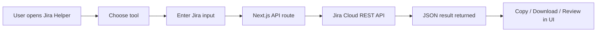

# Jira Helper

Jira Helper is a lightweight Jira Cloud operations dashboard for teams that need fast, JSON-first answers from Atlassian APIs without building custom scripts each time. It combines a clean UI with API routes that query Jira, perform updates, and return structured results that can be copied or downloaded.

## Overview

The app gives you a single place to run common Jira workflows such as:
- lookup an issue by key
- inspect all issues in a sprint
- pull a board snapshot
- review future-sprint work
- find carry-over tickets
- bulk-update issue statuses
- create multiple issues from CSV
- run JQL-powered reporting

Everything is designed to make Jira data easy to inspect and act on in one screen.

## Product-style feature summary

### Issue lookup
Quickly fetch one Jira issue by key and inspect the full payload returned by Jira.

- Input: issue key such as `PROJ-123`
- Output: Jira issue JSON with fields like summary, status, assignee, comments, and more

### Sprint review
Retrieve all issues in a sprint and include related comments in the result payload.

- Input: sprint name
- Output: Jira issues + comments + optional sprint metadata

### Board snapshot
Capture a board-level view of all issues on a given Agile board, including paginated results.

- Input: board ID
- Output: combined JSON list of issues from the board

### Future-sprint planning
Run a predefined future-sprint work query for selected squads and filter out AI-generated tickets based on comment markers.

- Input: none; built-in JQL is used
- Output: list of unresolved future-sprint issues ready for review

### Carry-over analysis
Identify tickets with carry-over reason/detail fields and optionally scope the results to one sprint.

- Input: optional sprint name
- Output: carry-over issue list with issue key and carry-over field values

### Bulk status update
Update every issue that matches a Jira query to a target status and apply a resolution during the transition.

- Input: JQL, target status, resolution, optional comment
- Output: update summary and per-issue results with success/error details

### CSV bulk create
Create multiple Jira issues in a single run from a CSV upload.

- Input: CSV file with project, issue type, summary, description, acceptance criteria, and component values
- Output: created/failed row summary with Jira error details when applicable

### JQL reporting
Run a JQL query and expand the returned issues with changelog data to build a report.

- Input: JQL Query
- Output: report rows with issue metadata and structured findings

### JSON result actions
Every tool includes a result viewer with copy-to-clipboard and download-as-JSON actions.

- Input: any result payload
- Output: formatted JSON in the page and a `.json` file download

## How it works

1. The user selects a tool from the home dashboard.
2. The app collects the required input, such as a Jira key, sprint name, board ID, or JQL.
3. A Next.js API route calls the Jira Cloud REST API with the configured credentials.
4. The backend validates the request, calls Jira, and transforms the response into a JSON result.
5. The UI renders the result in a readable JSON viewer.
6. The user can copy the payload or download it as a `.json` file for sharing or follow-up work.

This creates a fast, repeatable loop for operational Jira work without leaving the browser.

## App flow



## Screenshots

> Add screenshots here as the app is used in your environment.

### Home dashboard


### Ticket lookup


### Bulk status update


### JSON result panel


## Inputs and outputs

| Tool | Input | Output |
| --- | --- | --- |
| Ticket lookup | Issue key | Full Jira issue JSON |
| Sprint issues with comments | Sprint name | Sprint issues and comments |
| Board issues | Board ID | Issues from the board |
| Future sprints | Built-in JQL | Future-sprint worklist |
| Carry-over | Optional sprint name | Carry-over issue report |
| Bulk status change | JQL + status + resolution + optional comment | Per-issue success/error summary |
| CSV bulk create | CSV file upload | Created/failed issue rows |
| JQL reporting | JQL | Structured report rows |

## Required environment variables

Create a `.env.local` file in the project root:

```bash
JIRA_BASE_URL="https://your-domain.atlassian.net"
JIRA_EMAIL="your-email@example.com"
JIRA_API_TOKEN="your-api-token-here"
```

Optional custom field settings:

```bash
JIRA_SPRINT_FIELD="sprint"
JIRA_ACCEPTANCE_CRITERIA_FIELD="customfield_10100"
JIRA_CARRYOVER_REASON_FIELD="carryoverReason"
JIRA_CARRYOVER_DETAIL_FIELD="carryoverDetail"
```

## CSV format for bulk create

```csv
project,issue_type,summary,description,acceptancecriteria,component
ABC,Story,Add login page,Create the login page flow,User can sign in,Frontend
```

Required fields:
- `project`
- `issue_type`
- `summary`
- `description`
- `acceptancecriteria`
- `component`

## Running the app

```bash
npm install
npm run dev
```

Then open:

```text
http://localhost:3000
```

## Example output

```json
{
  "total": 3,
  "issues": [
    {
      "key": "PROJ-123",
      "fields": {
        "summary": "Example issue",
        "status": {
          "name": "In Progress"
        }
      }
    }
  ]
}
```

## Tech stack

- Next.js 14 App Router
- TypeScript
- Tailwind CSS
- Jira Cloud REST API
- JSON-first reporting workflow

## Linting

```bash
npm run lint
```
